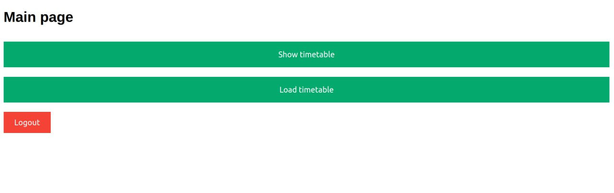
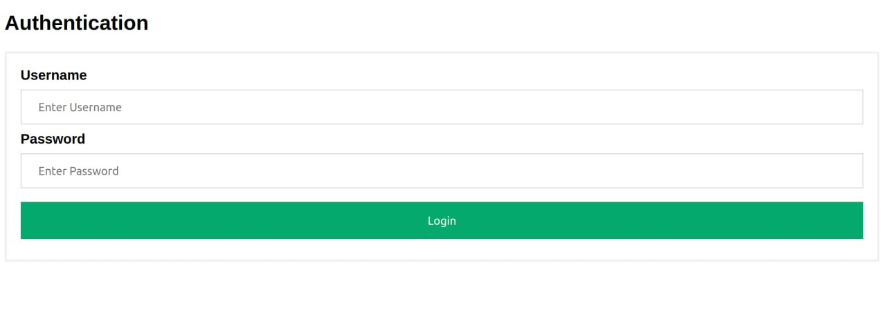
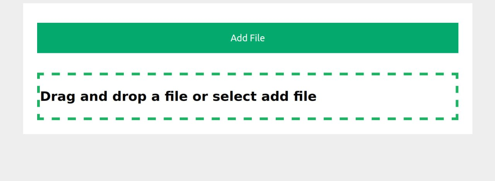
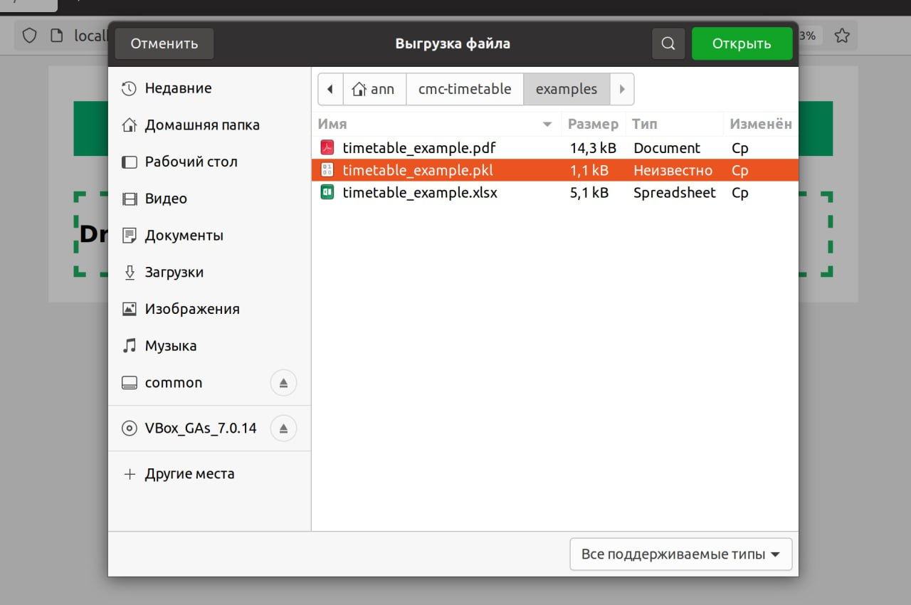
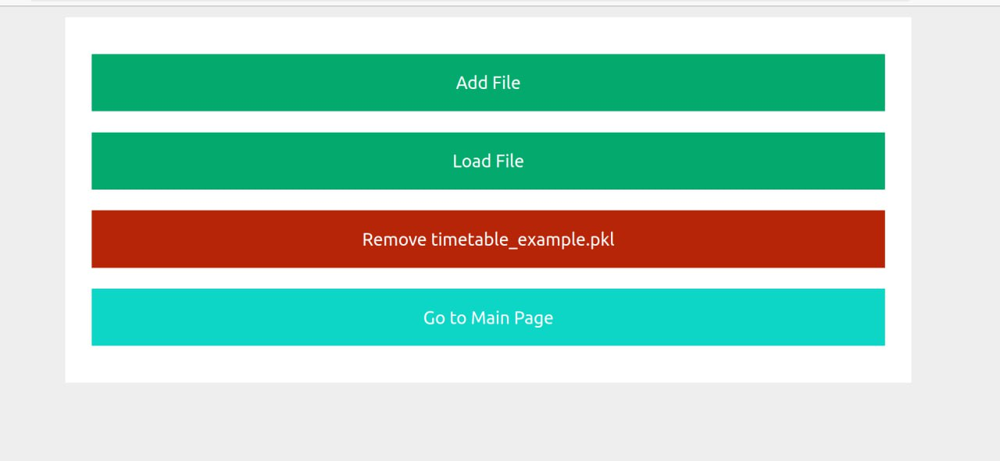
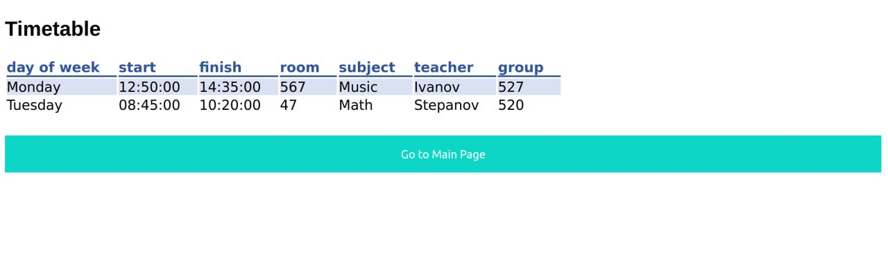

.. cmc-timetable documentation master file, created by
   sphinx-quickstart on Mon May 20 17:45:28 2024.
   You can adapt this file completely to your liking, but it should at least
   contain the root `toctree` directive.

Документация по проекту "Расписание занятий"
=========================================

.. toctree::
   :maxdepth: 2
   :caption: Contents:

.. _getting-started:

Главная страница сайта выглядит следующим образом:

Для просмотра расписания занятий, вам необходимо быть
зарегистрированным на нашем сайте и войти в свой аккаунт:

`Страница аутентификации <http://localhost:8000/auth/login>`_

Страница аутентификации выглядит следующим образом:

После этого можно перейти на страницу с расписанием занятий:

`Страница расписания <http://localhost:8000/timetable>`_

.. _table-upload:

Загрузка таблиц расписания(Только для администраторов)
============

Для загрузки таблицы расписания, вам необходимо быть авторизованным под администратором.
После этого перейти на страницу загрузки таблицы:
`Страница загрузки таблицы <http://localhost:8000/timetable/load>`_

Далее после того, как вы выбрали файл с расписанием занятий, необходимо
нажать на кнопку "Загрузить файл" и вам откроется окно загрузки, выберитев нем файл.

После этого вы увидите имя файла, который вы загрузили и кнопку "Загрузить файл".

После успешной загрузки таблицы, вас перенаправит на просмотр новой таблицы.

Поддерживаемые форматы таблиц
-----------------

Наш сайт на данном этапе разработки поддерживает следующие форматы таблиц:

- Pickle (`.pkl`)
- Excel (`.xlsx`)
- PDF (`.pdf`)

Вы можете загрузить таблицу в любом из этих форматов 
и наш сайт распарсит ее и отобразит ее в виде расписания занятий.

.. note::
   Если возникнут проблемы с загрузкой таблицы, пожалуйста, обратитесь к разработчику(`email <mailto:ezhovandr@gmail.com>`_).

Требования к оформлению таблицы
------------------

Для того, чтобы таблица была загружена на наш сайт, она должна соответствовать следующим требованиям:

- В таблице должны быть следующие колонки:
   - `subject` - название предмета
   - `teacher` - преподаватель
   - `day of week` - день недели
   - `start` - начало занятия
   - `finish` - конец занятия
   - `room` - комната
   - `group` - группа

